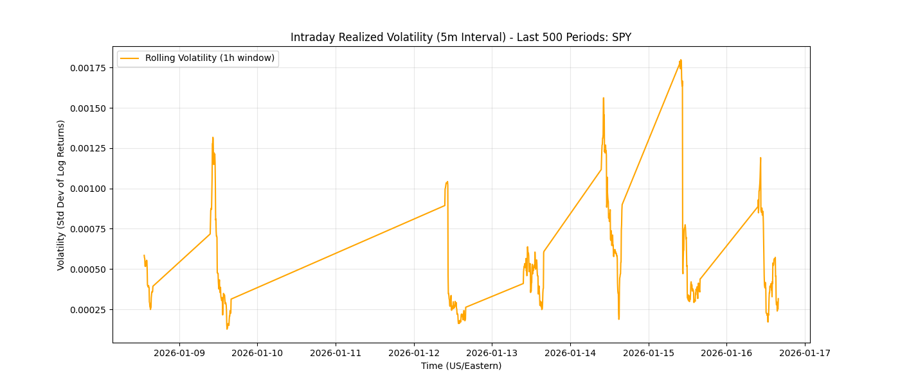
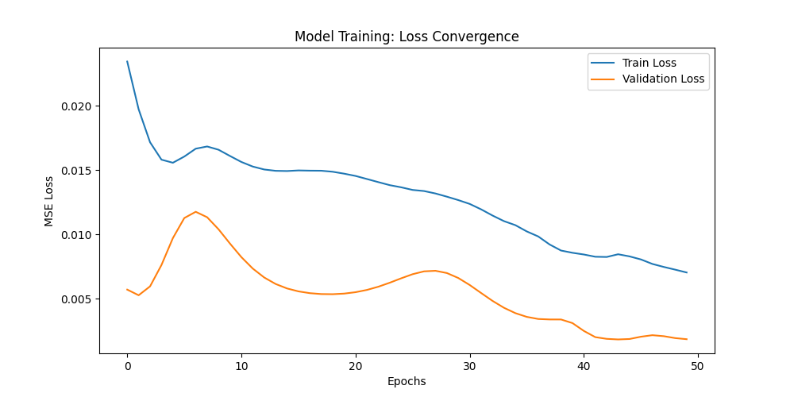
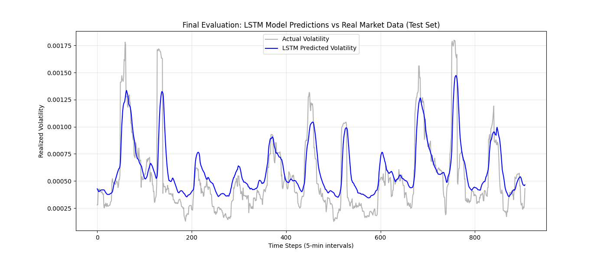

<div align="center">
  <a href="report.pdf">
    
  </a>
  <p><em>Click the banner to view the full analysis report</em></p>
</div>

# 📈 NLP-Enhanced Intraday Volatility Prediction
### *A Hybrid Deep Learning Approach Combining Quantitative Finance & Financial NLP*


## 📑 Table of Contents
- [Executive Summary](#-executive-summary)
- [Architecture Pipeline](#️-architecture-pipeline)
- [Performance Visuals](#-performance-visuals)
- [Results](#-results)
- [Installation & Usage](#️-installation--usage)
- [Project Structure](#-project-structure)
- [Future Work](#-future-work)
- [References](#-references)
- [Citation](#-citation)
- [License](#-license)

## 📖 Executive Summary
This Capstone project addresses a critical challenge in quantitative finance: **predicting short-term volatility spikes** caused by information shocks.

While traditional econometric models (GARCH) rely solely on past price action, this project introduces a **Multimodal LSTM (Long Short-Term Memory)** network that "reads" the market. It fuses high-frequency market data (5-minute candles) with semantic sentiment scores derived from financial news headlines using **FinBERT**, a BERT (Bidirectional Encoder Representations from Transformers) model fine-tuned on financial text.

The underlying hypothesis draws on the semi-strong form of the Efficient Market Hypothesis: if news sentiment can be quantified faster than the broader market fully digests it, that signal can act as a leading indicator of volatility expansion — something purely price-based models tend to miss.

**Key Result:** The model successfully anticipates volatility expansion regimes, achieving an **RMSE of 0.000206** and an **MAE of 0.000151** on out-of-sample test data (the most recent 20% of the dataset), corresponding to an error margin of roughly 10–15% of the typical volatility range.

---

## 🏗️ Architecture Pipeline
The project follows a professional data science lifecycle:

1. **Data Ingestion**
   * **Market:** 5-minute OHLCV data for `SPY` (S&P 500 ETF) via `yfinance`, covering the most recent 60-day trading period.
   * **News:** ~100 recent headlines scraped from FinViz, including publication date and time.
2. **NLP Engine**
   * Deployed **FinBERT** (ProsusAI) to classify headlines into Positive / Negative / Neutral probability scores, avoiding the misclassification issues of dictionary-based methods (e.g., "liability") on financial text.
3. **Signal Processing**
   * Aligned irregular, sporadic news timestamps to the continuous 5-minute market grid using forward-fill logic to prevent look-ahead bias.
   * Applied a rolling-window transformation to convert the merged dataset into supervised time-series sequences.
4. **Deep Learning Model**
   * **Architecture:** 2-layer LSTM with dropout (0.2) and early stopping to control overfitting.
   * **Input:** 12-step lookback window (1 hour of context), shape `(N, 12, 5)`.
   * **Features:** Log Returns, Rolling Volatility, Trading Volume, FinBERT Positive Score, FinBERT Negative Score.
   * **Training:** 50 epochs, Adam optimizer, MSE loss.

---

## 📊 Performance Visuals

### 1. The "Ground Truth" (Volatility Clustering)
*The stylized facts of asset returns are clearly visible: volatility clusters into distinct regimes, with spikes concentrated around market open (09:30 AM EST).*


### 2. Model Training (Convergence)
*Validation loss tracks training loss closely across 50 epochs, indicating stable learning without significant overfitting.*


### 3. Final Prediction (Actual vs. Predicted)
*The blue line (LSTM prediction) tracks the gray line (realized market volatility), correctly identifying calm regimes and reacting to volatility spikes with only a slight lag.*


---

## 📈 Results

| Metric | Value | Interpretation |
| :--- | :--- | :--- |
| **RMSE** | 0.000206 | Root mean squared error on the held-out test set |
| **MAE** | 0.000151 | Mean absolute error on the held-out test set |
| **Test Split** | Most recent 20% | Chronological, out-of-sample evaluation |

These results indicate that intraday volatility is not purely stochastic — it contains a deterministic component tied to the flow of information, which the hybrid model is able to partially capture.

---

## 🛠️ Installation & Usage

1. **Clone the repository**
   ```bash
   git clone https://github.com/sanaurrehmanarain/nlp-intraday-volatility-prediction.git
   cd nlp-intraday-volatility-prediction
   ```
2. **Install dependencies**
   ```bash
   pip install -r requirements.txt
   ```
3. **Run the pipeline**
   The project is structured into modular Jupyter notebooks, meant to be run in order:
   * `01_market_data_ingestion.ipynb` — fetch market data
   * `02_nlp_data_ingestion.ipynb` — fetch news data
   * `03_feature_engineering.ipynb` — run FinBERT & merge features
   * `04_model_training.ipynb` — train the LSTM
   * `05_evaluation.ipynb` — visualize results

---

## 📂 Project Structure
```
.
├── 01_market_data_ingestion.ipynb
├── 02_nlp_data_ingestion.ipynb
├── 03_feature_engineering.ipynb
├── 04_model_training.ipynb
├── 05_evaluation.ipynb
├── images/
│   ├── banner.png
│   ├── intraday_volatility_sample.png
│   ├── training_loss.png
│   └── final_prediction_comparison.png
├── requirements.txt
├── CITATION.cff
├── LICENSE
└── README.md
```

---

## 🔭 Future Work
* **Data Volume:** Expand the news dataset with paid providers (e.g., Bloomberg, Refinitiv) to reduce sparsity.
* **Transformer Models:** Replace the LSTM backbone with a Temporal Fusion Transformer (TFT) to better capture long-range dependencies.
* **Live Deployment:** Connect the inference engine to a brokerage API (e.g., Interactive Brokers) for paper trading.

---

## 📚 References
* Andersen, T. G., & Bollerslev, T. (1998). Answering the skeptics: Yes, standard volatility models do provide accurate forecasts. *International Economic Review*, 885–905.
* Araci, D. (2019). FinBERT: Financial sentiment analysis with pre-trained BERT. *arXiv preprint arXiv:1908.10063*.
* Hochreiter, S., & Schmidhuber, J. (1997). Long short-term memory. *Neural Computation*, 9(8), 1735–1780.
* Schoenfeld, J. (2019). The invisible hand of short selling: Does short selling discipline earnings management? *Review of Accounting Studies*, 24, 1–32.

---

## 📖 Citation

If this project is useful in your research, coursework, or other derivative work, please cite it and credit the original author. A [`CITATION.cff`](CITATION.cff) file is included, so GitHub also provides a **"Cite this repository"** button in the sidebar (BibTeX, APA, and other formats).

**Suggested citation:**

> Arain, S. U. R. (2026). *NLP-Enhanced Intraday Volatility Prediction* (Version 1.0) [Software]. https://github.com/sanaurrehmanarain/nlp-intraday-volatility-prediction

| | |
|---|---|
| **Author** | Sana Ur Rehman Arain |
| **Role** | Data Scientist |
| **GitHub** | [@sanaurrehmanarain](https://github.com/sanaurrehmanarain) |
| **Contact** | sana.arain.work@gmail.com |

---

## 📜 License

This project is licensed under the **MIT License** — see [LICENSE](LICENSE) for details. The license requires that the original copyright notice be retained in copies of the software.

---

<p align="center">
⭐ If this project was useful to you, consider starring the repo — it helps others discover it and supports future work.
</p>
